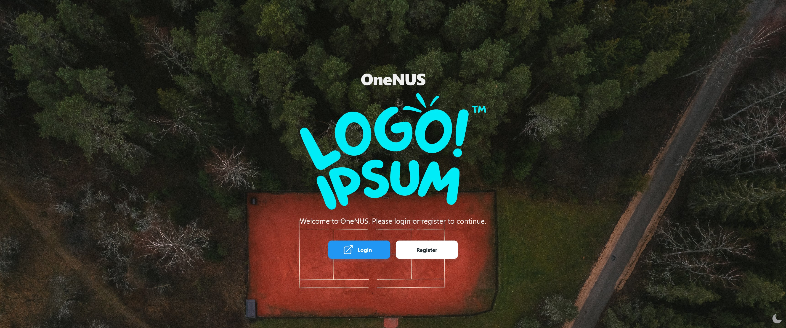
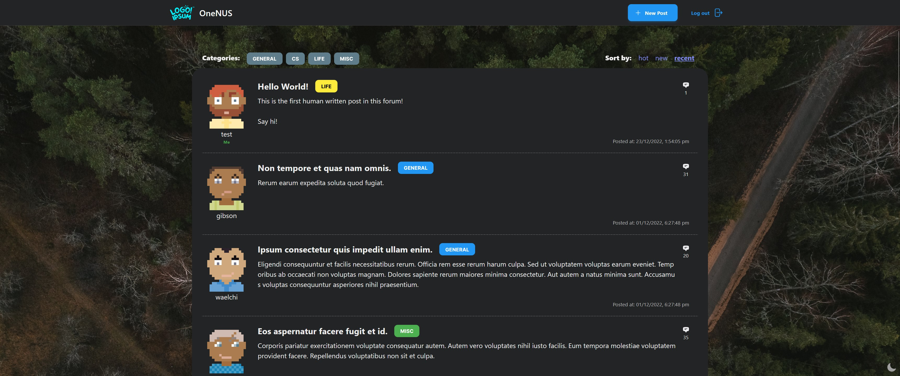

# OneNUS [22/23 CVWO Winter Assignment]

A webforum with simplicity in mind.

<br/>

# Project Status

This project is currently still in development.

- Functionality for categorizing posts is still in progress.
- Mobile support is still severely lacking
- Starring of posts is not yet available

Last updated: 22/12/22

<br/>

# Demo

You can find the live version of this project [here](https://app.onenus.link).

### Screenshots

|                              |                                |
| :--------------------------: | :----------------------------: |
|  |        |
|      |  |

<br/>

# Building this project

## Prerequisites

1. `NodeJS`

   Install [NodeJS](https://nodejs.org/en/download/) if you have not done so yet.

2. `yarn`

   This project uses [`yarn`](https://classic.yarnpkg.com/lang/en/docs/install/) as the package manager instead of `npm`.

<br/>

## Installation

1. Clone this repo.
   ```
   $ git clone https://github.com/mfjkri/One-NUS.git
   ```
2. Change into the repo directory.
   ```
   $ cd One-NUS
   ```
3. Install project dependencies.

   ```
   $ yarn install
   ```

4. Required config files.

   Create a dotenv file `.env` under the root directory with the following variables:

   ```python
   REACT_APP_API_URL: PRODUCTION_API_URL # Production API endpoint
   REACT_APP_LOCAL_API_URL: LOCAL_API_URL # Local testing API endpoint
   REACT_APP_API_MOCKING: false # Whether to use production or local API for local testing (in production mode it will use PRODUCTION_API_URL regardless)
   ```

5. Start test server.

   ```
   $ yarn start
   ```

6. All set!

   You can view the app at [localhost:3000](http://localhost:3000).

   _Note_: If there is already an application listening to the default port:3000, it will try and use another port. See your terminal for more info.

<br/>

# Table of Contents

- [OneNUS \[22/23 CVWO Winter Assignment\]](#onenus-2223-cvwo-winter-assignment)
- [Project Status](#project-status)
- [Demo](#demo)
  - [Screenshots](#screenshots)
- [Building this project](#building-this-project)
  - [Prerequisites](#prerequisites)
  - [Installation](#installation)
- [Table of Contents](#table-of-contents)
- [Technologies used](#technologies-used)
- [Project Structure](#project-structure)
- [Routes](#routes)
- [State management](#state-management)
- [Features](#features)
- [Deployment](#deployment)

<br/>

# Technologies used

- [ReactJS](https://reactjs.org/) with [Typescript](https://www.typescriptlang.org/)
- [React Query](https://react-query-v3.tanstack.com/) - Data synchronization
- [React Query Auth](https://github.com/alan2207/react-query-auth) - User authentication
- [Axios](https://axios-http.com/docs/intro) - HTTP Client
- [TailwindCSS](https://tailwindcss.com/) - CSS Framework
- [Material Tailwind](https://www.material-tailwind.com/) - UI-Components library
- [HeadlessUI](https://headlessui.com/) - Unstyled UI-Components library
- [React Hook Form](https://react-hook-form.com/) - Form validation
- [Zod](https://zod.dev/) - Schema validation

- Misc:
  - [Dicebear Avatars](https://avatars.dicebear.com/) - User avatars
  - [Heroicons](https://heroicons.com/) - UI icons

<br/>

# Project Structure

This project uses a structure inspired by [bullet-proof-react](https://github.com/alan2207/bulletproof-react/) by [Alan Alickovic ](https://github.com/alan2207).

Read the full detailed explanation [here](https://github.com/alan2207/bulletproof-react/blob/master/docs/project-structure.md).

All of the codebase resides in the [`src`](src/) directory.

Some key sub-directories in src are:

- [`src/components/`](src/components/) - Shared components with reusable functionality (eg. Button, Link)
- [`src/features/`](src/features/) - Components with specific functionality (eg. Auth, Post, Comment)
- [`src/routes`](src/routes/) - Routing for the app (see the [Routes](#Routes) section for more inf for more information)
- [`src/config/`](src/config/) - Environment variables and global configuration values are exported and accessible here.

<br/>

# Routes

Routing in this project is managed by [`react-router-dom v6.4.5`](https://reactrouter.com/en/main).

Global routing is defined in [src/routes/index.jsx](src/routes/index.tsx) which splits routes into two categories:

- Public: Freely accessible (includes pages to login and register)
- Protected: Requires user authentication to access

Only routing _TO_ the feature is handled here. Further sub-routing _WITHIN_ the feature are handled by the respective feature itself in `src/$FEATURENAME/routes/index.tsx`.

e.g. [`src/auth/routes/index.jsx`](src/features/auth/routes/index.tsx)

<br/>

# State management

...

<br/>

# Features

There are 3 main features in this app.

- [`auth`](src/features/auth/) - User authentication (Login & Register)
- [`posts`](src/features/posts/) - Forum posts
- [`comments`](src/features/comments/) - Forum comments

Each feature follows the convention below:

- `api`: Handles any API calls made by the feature
- `components`: Contains any components used in this feature (Any non-specific or reusable components should go in [src/components/\*](src/components/))
- `routes`: Handles any sub-routing within the feature
- `types`: Defines any custom types used in this feature
- `index.ts`: Exports all required components or types that is used elsewhere (e.g. by other features)

Note that each subdirectory in this convention is optional and can be left out if not required by the feature (e.g. comments feature does not have a routes/ subdirectory as it not have any subrouting within it)

<br/>

# Deployment

This app is deployed to an [AWS S3 bucket](https://aws.amazon.com/s3/) served using [Cloudfront](https://aws.amazon.com/cloudfront/) and [Route 53](https://aws.amazon.com/route53/).

Signed SSL certificates for the domain are provided by [AWS ACM](https://aws.amazon.com/certificate-manager/).
