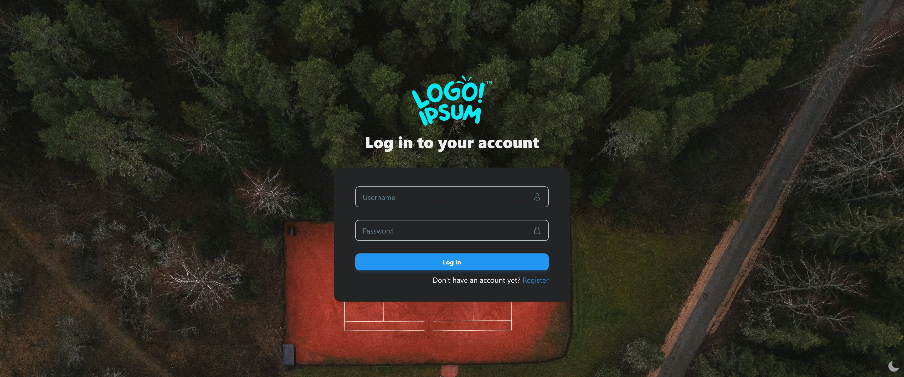
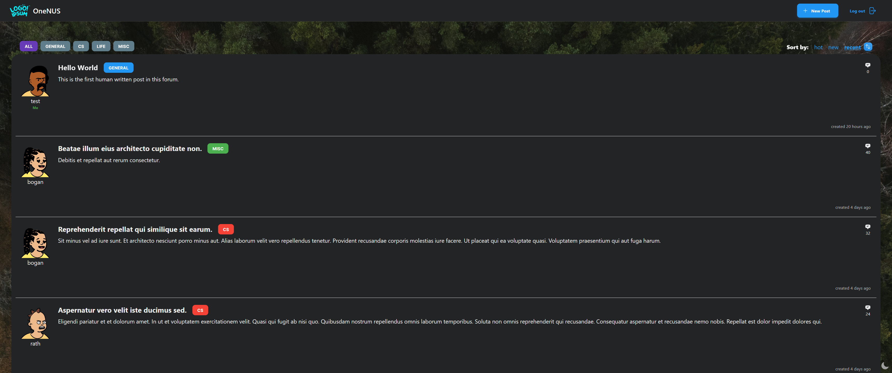
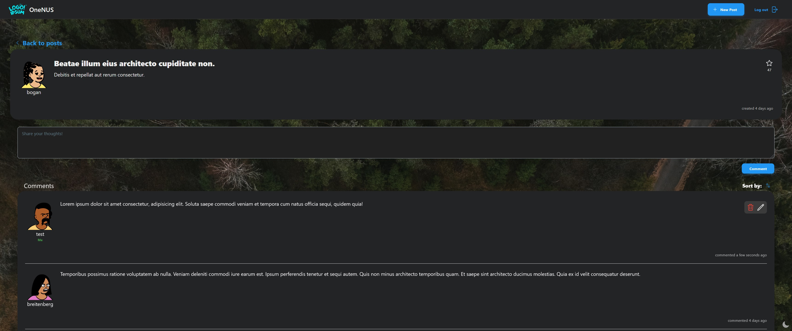

# OneNUS [22/23 CVWO Winter Assignment]

_A webforum designed with simplicity in mind._

## 🎮 Demo

You can find the **live version** of this project [here](https://app.onenus.link).

### Backend

You can find the backend API that this project consumes [here](https://github.com/mfjkri/OneNUS-Backend).

### Screenshots

|                                     |                                       |
| :---------------------------------: | :-----------------------------------: |
|  |      |
|      |  |

## 💻 Project Overview

| Project aspect  | Technologies used                                                                                                                                                                                                                                                                                                                        |
| --------------- | ---------------------------------------------------------------------------------------------------------------------------------------------------------------------------------------------------------------------------------------------------------------------------------------------------------------------------------------- |
| Frontend        | Typescript + React<br>See [⚡️Technologies](docs/technologies-used.md#%EF%B8%8Ftechnologies) for more details.                                                                                                                                                                                                                           |
| Backend         | Golang + Gin + Gorm                                                                                                                                                                                                                                                                                                                      |
| Database        | MySQL                                                                                                                                                                                                                                                                                                                                    |
| Deployment plan | Frontend: AWS S3 Bucket + Cloudfront<br>See [🌐 Deployment](docs/deployment.md#-deployment) for more details.<br><br>Backend: AWS EC2 + Nginx (reverse proxy)<br>See [Backend Deployment](https://github.com/mfjkri/OneNUS-Backend/blob/master/docs/deployment.md) for more details.<br><br>Database: AWS EC2 (same instance as backend) |

## ❔Project Status

Basic requirements: Completed ✅ (as of 22/12/22)

See more upcoming features at: [💡 Future Plans](docs/project-plans.md#-future-plans)

## 📌 Project Requirements

1. 🔓 Basic authentication

   - Each user is authenticated via a `username` and a `password`.
   - Usernames are case-insensitive and limited to 10 characters.

2. ✍️ Basic CRUD features for posts and comments

   - Users can create, view, edit and delete their posts and comments.
   - Users can only edit or delete their own comments and posts.

3. 🗂 Category tagging for posts

   - Users can filter posts by category to allow for easier searching.

4. 👤 User profiles
   - Users can view their own as well as other user profiles to see their forum statistics.

## 🛠 Building the project

### Prerequisites

1. `NodeJS`

   Install [NodeJS](https://nodejs.org/en/download/) if you have not done so yet.

2. `yarn`

   This project uses [`yarn`](https://classic.yarnpkg.com/lang/en/docs/install/) as the package manager instead of `npm`.

### Installation

1. Clone this repo.
   ```
   $ git clone https://github.com/mfjkri/OneNUS.git
   ```
2. Change into the repo directory.
   ```
   $ cd OneNUS
   ```
3. Install project dependencies.

   ```
   $ yarn install
   ```

4. Create a `.env` file from the template `.env.example` file.

   ```
   $ cp .env.example .env
   ```

   Modify the following environment variables in the newly created `.env` file accordingly:

   ```python
   REACT_APP_API_URL=PRODUCTION_API_URL # Production API endpoint
   REACT_APP_LOCAL_API_URL=LOCAL_API_URL # Local testing API endpoint
   REACT_APP_API_MOCKING=false # Whether to use production or local API for local testing (in production mode it will use PRODUCTION_API_URL regardless)
   ```

5. Start test server.

   ```
   $ yarn start
   ```

6. All set!

   You can view the app at `localhost` port `3000` by default: [localhost:3000](http://localhost:3000).

## 📚 Table of Contents

- [⚡️Technologies](docs/technologies-used.md#%EF%B8%8Ftechnologies)
- [📂 Project Structure](docs/project-details.md#-project-structure)
- [💾 State Management](docs/project-details.md#-state-management)
- [🌐 Deployment](docs/deployment.md#-deployment)
- [💡 Future Plans](docs/project-plans.md#-future-plans)
- [✨ Future Considerations](docs/technologies-used.md#-future-considerations)

## 👏 Credits

- Project structure inspiration: https://github.com/alan2207/bulletproof-react
- Website Logo: https://logoipsum.com/
- Website Background: https://unsplash.com/photos/v6uXUGQSDLY
- User Avatars: https://www.figma.com/community/file/829741575478342595 : [License](https://creativecommons.org/licenses/by/4.0/)
